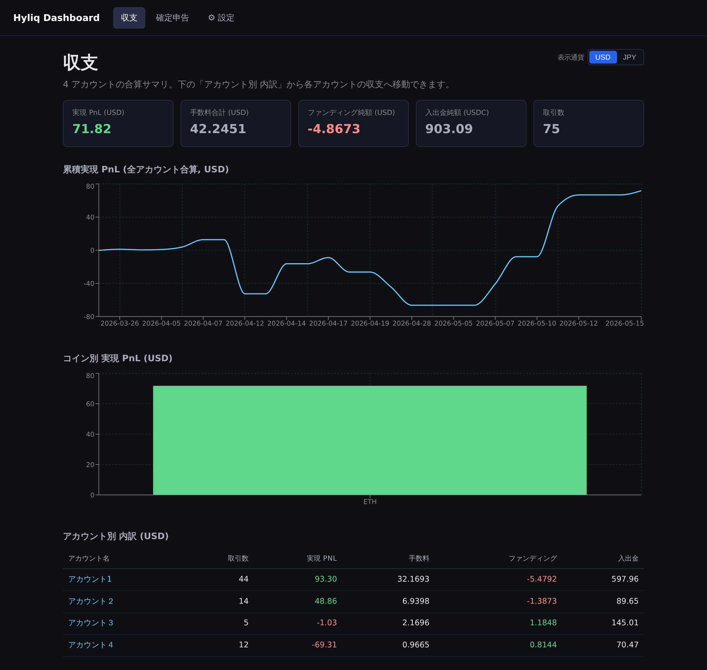
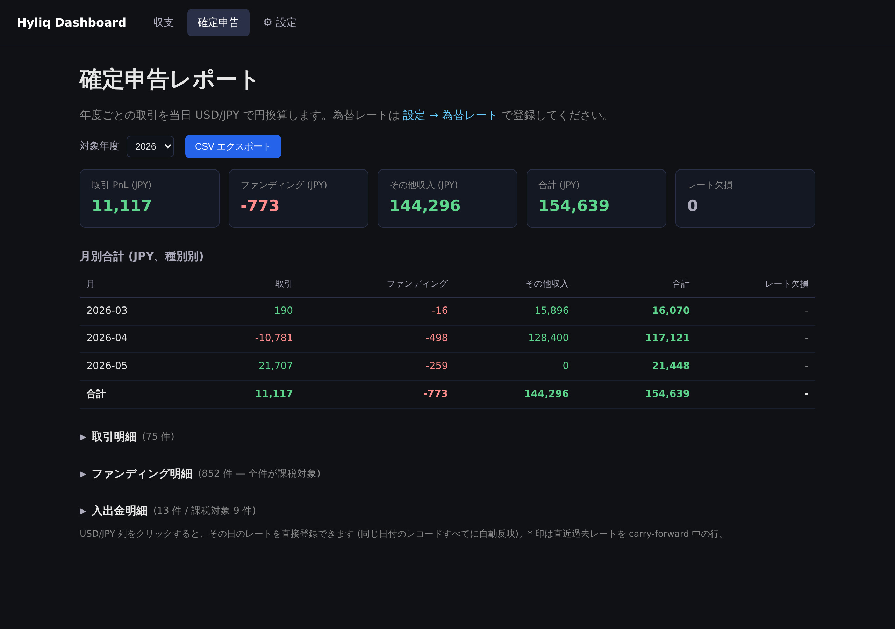
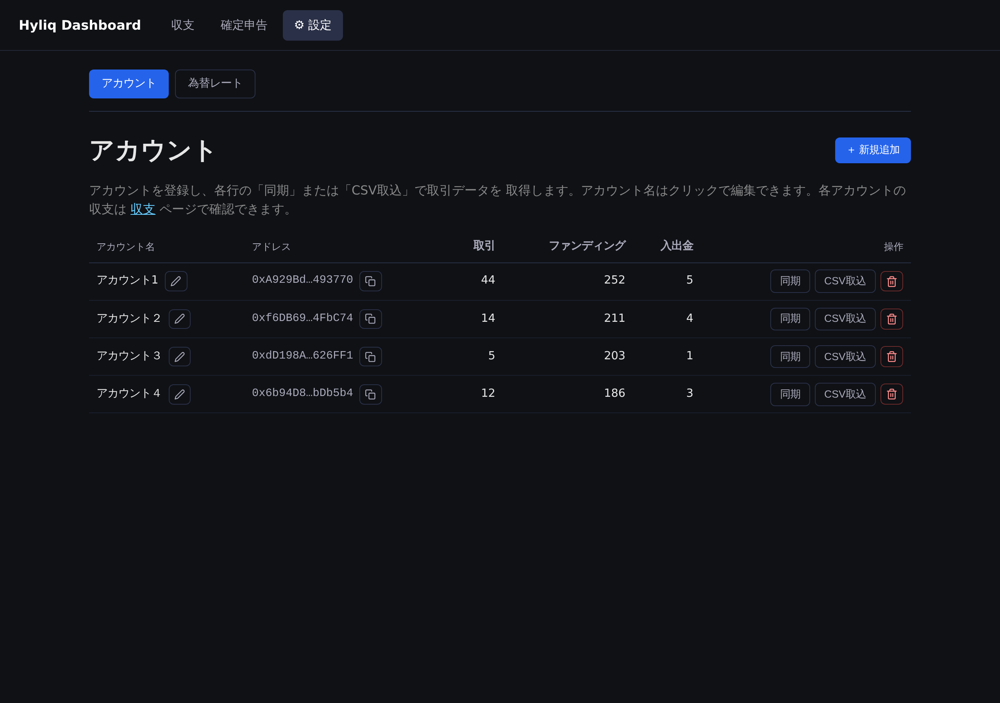

# Hyliq Dashboard

Hyperliquid (Perpetuals) の取引データを **公式 API での自動同期** または **CSV 取り込み** で取得し、損益を可視化・確定申告用に JPY 換算するための個人用 Web アプリ。

## 画面

### 収支ダッシュボード

全アカウント合算の実現損益・累積 PnL 推移・コイン別損益・アカウント別内訳をまとめて表示します（USD / JPY 切替対応）。



### 確定申告レポート

年度ごとに取引・ファンディング・入出金を当日 USD/JPY で円換算。月別集計と CSV エクスポートに対応します。



### アカウント管理

アドレス登録、Hyperliquid 公式 API からのデータ同期、CSV 取り込みをアカウント単位で行います。



## ⚠️ セキュリティ上の注意

このリポジトリは **ローカル / 個人利用を前提** にしています。
`pb_migrations/1748000000_default_superuser.js` に PocketBase 管理画面の
デフォルト管理者 (`admin@local.app` / `hyliqdashboard`) が **平文でハードコード**
されています。

- このまま PocketBase を **公開ネットワークに晒さないこと**
- 本番運用・他者との共有・恒久利用をする場合は、**必ずこのパスワードを変更**
  するか、認証情報を環境変数 (`PB_ADMIN_PASSWORD` 等) に退避してから運用して
  ください

## 構成

- **フロント**: React + Vite + TypeScript (`client/`)
- **バックエンド**: PocketBase (Docker 1 コンテナ)
- **DB**: PocketBase 内蔵 SQLite (`pb_data/`、Git 除外)
- **スキーマ管理**: `pb_migrations/` 配下の JS マイグレーション

```
hyliq_dashboard/
├── docker-compose.yml      # PocketBase 起動定義
├── pb_migrations/          # コレクション定義 (Git 管理)
├── pb_data/                # 永続データ (gitignore)
├── client/                 # React アプリ
└── sample_csv/             # サンプル CSV
```

## セットアップ

### 1. 一括起動 (推奨)

```sh
docker compose up -d
```

これで PocketBase (8090) と Vite dev server (5173) が両方立ち上がります。

- PocketBase 管理画面: <http://localhost:8090/_/> (デフォルト管理者は migration
  で自動作成 — 上記「セキュリティ上の注意」参照)
- アプリ: <http://localhost:5173/>
- `pb_migrations/` 配下の migration が自動適用、Vite は host bind mount で
  HMR (ソース変更が即反映)、`node_modules` は named volume `client_node_modules`
  に隔離

### サービス別の操作

```sh
docker compose restart client      # Vite だけ再起動
docker compose restart pocketbase  # PocketBase だけ再起動
docker compose logs -f client      # Vite ログ追従
docker compose stop client         # Vite だけ停止
docker compose down                # 全停止 (named volume は残る)
docker compose down -v             # 全停止 + named volume 削除 (node_modules リセット)
```

### IDE 開発用に host で直接動かしたい場合

`docker compose stop client` してから:

```sh
cd client
cp .env.example .env   # 必要に応じて編集
npm install
npm run dev
```

(host の `client/node_modules` は IDE 用に独立して保持される)

### 開発時のチェック

```sh
cd client
npm test            # lint + 単体テスト (61 件)
npm run check       # lint + 型チェック (tsc) + 単体テスト の全部
npm run test:integration   # 実 PocketBase に対する統合テスト
npm run lint        # ESLint のみ
```

## コレクション

| 名前 | 用途 |
|---|---|
| `accounts` | アカウントアドレス管理 |
| `trades` | Perp 取引履歴 (Open/Close Long/Short) |
| `fundings` | ファンディング履歴 |
| `transfers` | 入出金履歴 |
| `fx_rates` | USD/JPY レートキャッシュ |

各データ系コレクションは `hash` フィールドに UNIQUE 制約を持ち、CSV 再アップロード時の重複登録を防ぎます。

## 主な機能

### データ取得
- **API 自動同期**: ウォレットアドレスを登録すると、Hyperliquid 公式 API から
  取引・ファンディング・入出金を月単位で取得
- **CSV 取り込み**: Hyperliquid からエクスポートした CSV (取引履歴 / ファンディング /
  入出金) をアカウント単位で取り込み。種別の自動判定と `hash` による重複検出付き
- アドレスは QR コード画像のアップロードからも入力可能

### 収支の可視化
- 全アカウント合算の収支ダッシュボード (実現 PnL / 手数料 / ファンディング / 入出金)
- 累積実現 PnL の推移グラフ、コイン別実現 PnL
- アカウント別の内訳と、アカウント単位の詳細ページ
  (KPI・チャート・オープンポジション・直近取引)
- USD / JPY 表示切替

### 確定申告レポート
- 年度ごとに取引・ファンディング・入出金を当日 USD/JPY で円換算
- 月別・種別別の集計、入出金の課税対象トグル
- 会計ソフト取り込み用の CSV エクスポート

### 為替レート
- みずほ銀行の TTM 公示仲値 CSV 取り込み (期間指定可)
- Frankfurter (ECB) API からの取得
- レート未登録日は直近過去レートで carry-forward
